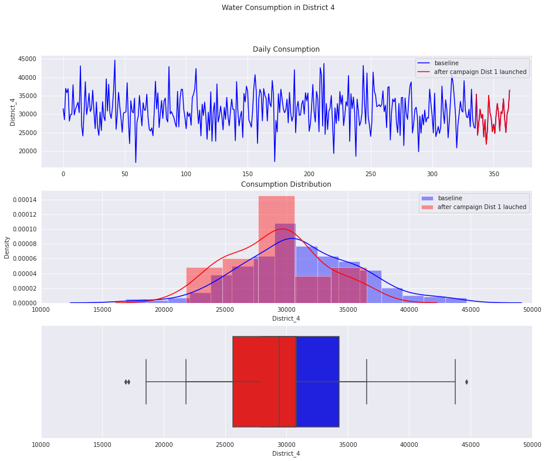
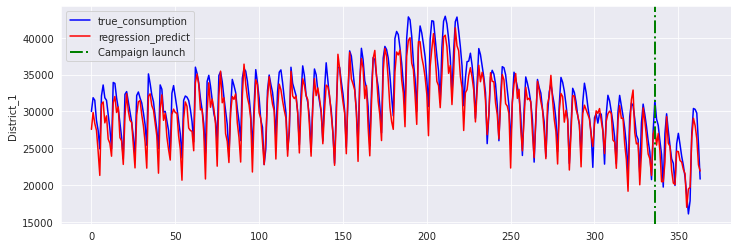

## Problem Definition
- A campaign is running to reduce the water consumption in District 1. 
- The city has 11 districts (Campaign only runs at District 1)
- Let's see how effective this campaign is

## Data Overview
- The row is the daily water consumption (in liters). There are total 364 rows (364 days) continuously from 01-January.
- The columns are 11 district
- The campaign ran only in District 1 for the last 28 days (02-Dec to 30-Dec).

## Objective
- Evaluate whether the campaign have any significant impact on the water consumption in District 1? How much?

<table border="1" class="dataframe">  <thead>    <tr style="text-align: right;">      <th></th>      <th>District_1</th>      <th>District_2</th>      <th>District_3</th>      <th>District_4</th>      <th>District_5</th>      <th>District_6</th>      <th>District_7</th>      <th>District_8</th>      <th>District_9</th>      <th>District_10</th>      <th>District_11</th>    </tr>    <tr>      <th>Day</th>      <th></th>      <th></th>      <th></th>      <th></th>      <th></th>      <th></th>      <th></th>      <th></th>      <th></th>      <th></th>      <th></th>    </tr>  </thead>  <tbody>    <tr>      <th>01-01</th>      <td>30000.00</td>      <td>25188.97</td>      <td>28538.15</td>      <td>31483.59</td>      <td>30486.67</td>      <td>30892.30</td>      <td>30613.86</td>      <td>27324.14</td>      <td>25658.25</td>      <td>28994.79</td>      <td>27645.36</td>    </tr>    <tr>      <th>02-01</th>      <td>31859.96</td>      <td>32538.84</td>      <td>38301.84</td>      <td>28500.64</td>      <td>33390.60</td>      <td>30254.08</td>      <td>24096.06</td>      <td>30740.24</td>      <td>28504.75</td>      <td>32948.60</td>      <td>32895.67</td>    </tr>    <tr>      <th>03-01</th>      <td>31516.08</td>      <td>36534.43</td>      <td>24865.96</td>      <td>37001.22</td>      <td>30877.25</td>      <td>26671.67</td>      <td>23436.28</td>      <td>30992.98</td>      <td>27555.64</td>      <td>30934.14</td>      <td>31562.64</td>    </tr>    <tr>      <th>04-01</th>      <td>28790.81</td>      <td>19551.51</td>      <td>32441.73</td>      <td>35832.19</td>      <td>40637.68</td>      <td>35049.81</td>      <td>32555.86</td>      <td>28242.00</td>      <td>27142.70</td>      <td>31642.02</td>      <td>27085.91</td>    </tr>    <tr>      <th>05-01</th>      <td>27434.27</td>      <td>33289.90</td>      <td>30563.99</td>      <td>36903.76</td>      <td>36365.24</td>      <td>27596.44</td>      <td>19360.99</td>      <td>28404.61</td>      <td>33131.36</td>      <td>29676.91</td>      <td>23879.14</td>    </tr>  </tbody></table>

## Hypothesis (select  = 5%)
- $H_{0}$: Campaign didn't have any impact on District 1 (coefficient of treament in linear equation with consumption = 0)
- $H_{1}$: Campaign actually reduce the water consumption in District 1 (coefficient of treament in linear equation is significantly negative)
- One-tailed test valuation

## Helper Function
- Preproc to plot, eda, and decompose time-series into cyclic seasonality features

### Example of Data Exploration

#### DISTRICT 1

#### DISTRICT 4

#### Notes:
- There could be a consumption distribution shift after the campaign lauched in District 1
- However, we're still unsure if the change is due to campaign or it's just seasonal effect, or it's just a randomness

### Convert time seasonal feature into cyclic features (Fourier Series) with sin and cos:
- Weekly cyclic features as the habit of using water can be repeated with the same weekday
- Yearly cyclic features as the habit of using water can vary depend upon season (i.e: more water used in summer than winter)
- Fourier series are decomposed at level 3
- Assume the day starts from 01/01

## Linear Regression Analysis for consumption of District 1 at day $t$
$
\begin{align}
C_{k}(t) = \frac{a_{0}}{2} + \sum \limits _{n=1} ^{3} \bigg[a_{n}cos\frac{2n\pi t}{T} + b_{n}sin\frac{2n\pi t}{T}\bigg]
+ c_{0} Treatment(t)
+ \sum \limits _{j=1, j \neq k} ^{11} d_{j} C_{j}(t)
\end{align}
$  
where (among 11 districts):  
- $C_{k}(t)$: Water consumption at day $t$ at district $k$   
- $C_{j}(t)$: Water consumption at day $t$ at district $j \neq k$   
- $d_{j}$: Coefficients of consumption impact from district $j$ to district $ k$   
- Fourier Series shows the seasonality relationship. We have both weekly and yearly seasonality  
- $ T = 7 $ for weekly seasonality, $ T = 12 $ for yearly seasonality  
- order of Fourier Series: 3  
- $Treatment(t)$ is binary values to show whether the campaign is launched at $t$  
    - Treatment = 0 before week 48 ($t \leq 335$)
    - Treatment = 1 after campaign start at week 48 ($t \geq 336$)

#### The objective is to see if $ c_{0} $ is significant negative than 0, this means the campaign is effective

### OLS Regression Analysis for District 1

                                OLS Regression Results                            
    ==============================================================================
    Dep. Variable:             District_1   R-squared:                       0.924
    Model:                            OLS   Adj. R-squared:                  0.919
    Method:                 Least Squares   F-statistic:                     219.1
    Date:                Sat, 23 Oct 2021   Prob (F-statistic):          3.54e-179
    Time:                        13:01:00   Log-Likelihood:                -3134.9
    No. Observations:                 364   AIC:                             6310.
    Df Residuals:                     344   BIC:                             6388.
    Df Model:                          19                                         
    Covariance Type:            nonrobust                                         
    =======================================================================================
                              coef    std err          t      P>|t|      [0.025      0.975]
    ---------------------------------------------------------------------------------------
    Intercept            2345.2424   1378.097      1.702      0.090    -365.315    5055.800
    sin_week_1n          1023.8563    125.315      8.170      0.000     777.377    1270.336
    cos_week_1n           796.9244    118.620      6.718      0.000     563.612    1030.236
    sin_week_2n          -235.4524    104.993     -2.243      0.026    -441.961     -28.943
    cos_week_2n           577.6707    110.006      5.251      0.000     361.301     794.041
    sin_week_3n          -283.3212    105.442     -2.687      0.008    -490.714     -75.928
    cos_week_3n           -93.3627    103.557     -0.902      0.368    -297.047     110.321
    sin_year_1n            50.8952     36.073      1.411      0.159     -20.056     121.846
    cos_year_1n          -394.9983     48.188     -8.197      0.000    -489.778    -300.218
    sin_year_2n            50.8952     36.073      1.411      0.159     -20.056     121.846
    cos_year_2n          -394.9983     48.188     -8.197      0.000    -489.778    -300.218
    sin_year_3n            50.8952     36.073      1.411      0.159     -20.056     121.846
    cos_year_3n          -394.9983     48.188     -8.197      0.000    -489.778    -300.218
    District_2              0.0098      0.015      0.650      0.516      -0.020       0.039
    District_3              0.0173      0.015      1.182      0.238      -0.012       0.046
    District_4              0.0176      0.016      1.129      0.260      -0.013       0.048
    District_5              0.0392      0.016      2.423      0.016       0.007       0.071
    District_6              0.0662      0.016      4.174      0.000       0.035       0.097
    District_7              0.0570      0.016      3.625      0.000       0.026       0.088
    District_8              0.0707      0.018      3.884      0.000       0.035       0.106
    District_9              0.1222      0.020      6.198      0.000       0.083       0.161
    District_10             0.1674      0.024      7.066      0.000       0.121       0.214
    District_11             0.3606      0.027     13.357      0.000       0.307       0.414
    Treament_District_1  -880.0455    312.816     -2.813      0.005   -1495.317    -264.773
    ==============================================================================
    Omnibus:                        0.584   Durbin-Watson:                   1.442
    Prob(Omnibus):                  0.747   Jarque-Bera (JB):                0.507
    Skew:                          -0.091   Prob(JB):                        0.776
    Kurtosis:                       3.017   Cond. No.                     2.13e+19
    ==============================================================================
    
    Notes:
    [1] Standard Errors assume that the covariance matrix of the errors is correctly specified.
    [2] The smallest eigenvalue is 7.84e-27. This might indicate that there are
    strong multicollinearity problems or that the design matrix is singular.

- Regression result shows that p-value of treatment coefficient = 0.005 < 0.05 / 2 for district 1
- This means we can reject the null hypothesis. The coefficient of treament effect is negatively significant and different from 0
- the daily water consumption at District 1 is predicted to be lower by 880 litres (compared with the usual day), thanks to this campaign
- Also, p-value of variable `cos_week_3n`,  `sin_year_3n`, `sin_year_1n`, `sin_year_2n`, `sin_year_3n`, and `consumption of district 2 to 4`  > 0.05, so this means those variables are not statistically significantly different from 0. So we can remove this from function
- The consumption of district 5 - 11 signficantly impacts the consumption at district 1

#### The water consumption model of District 1 is, therefore, explicitly represented by:

$\begin{align}
C_{1}(t) = 2345.2424 
                           + 1023.8563 sin{\frac{2 \pi t}{7}} + 796.9244 cos{\frac{2 \pi t}{7}} 
                           - 235.4524 sin{\frac{4 \pi t}{7}} + 577.6707 cos{\frac{4 \pi t}{7}}
                           - 871.0032 sin{\frac{6 \pi t}{7}}
\end{align}$
$\begin{align}
                           - 394.9983 cos{\frac{2 \pi t}{12}} 
                           - 394.9983 cos{\frac{4 \pi t}{12}}
                           - 394.9983 cos{\frac{6 \pi t}{12}}
\end{align}$
$\begin{align}
                           + 0.0392 C_{5}(t) + 0.0662 C_{6}(t) + 0.057 C_{7}(t)
\end{align}$
$\begin{align}
                           +  0.0707 C_{8}(t) + C_{9}(t) + 0.1674 C_{10}(t)
                           +  0.3606 C_{11}(t)
                           - 880.0455 Treatment(t)
\end{align}$

## Fit Metrics and Plots:

- Adjusted R squared =  0.919463566534413  
- RMSE               =  1933.1728706098218  
- MAE                =  1594.4797710850528   
- MAPE               =  0.051321756495113925  

##### DISTRICT 1 CONSUMPTION

- So we conclude the campaign at District 1 has the great impact to the consumption at District. The campaign can effectively reduce the water consumption by 880 litres, on average
- But do the campaign in District 1 also impacts other Districts ???

## Evaluate if the campaign in District 1 also impact other districts. Now we replace the fitting function with each district from 2 to 11

#### We can have the `p-value` summary of each coefficients for each district regression analysis as follows:

<table border="1" class="dataframe">  <thead>    <tr style="text-align: left;">      <th>Output</th>      <th>Coeff. Treament District 1</th>      <th>Coeff. District 1</th>      <th>Coeff. District 2</th>      <th>Coeff. District 3</th>      <th>Coeff. District 4</th>      <th>Coeff. District 5</th>      <th>Coeff. District 6</th>      <th>Coeff. District 7</th>      <th>Coeff. District 8</th>      <th>Coeff. District 9</th>      <th>Coeff. District 10</th>      <th>Coeff. District 11</th>    </tr>  </thead>  <tbody>    <tr>      <td>District 1</td>      <td>0.005</td>      <td></td>      <td>0.516</td>      <td>0.238</td>      <td>0.260</td>      <td>0.016</td>      <td>0.000</td>      <td>0.000</td>      <td>0.000</td>      <td>0.000</td>      <td>0.000</td>      <td>0.000</td>    </tr>    <tr>      <td>District 2</td>      <td>0.252</td>      <td>0.516</td>      <td></td>      <td>0.374</td>      <td>0.860</td>      <td>0.463</td>      <td>0.403</td>      <td>0.448</td>      <td>0.562</td>      <td>0.046</td>      <td>0.138</td>      <td>0.961</td>    </tr>    <tr>      <td>District 3</td>      <td>0.909</td>      <td>0.238</td>      <td>0.374</td>      <td></td>      <td>0.914</td>      <td>0.430</td>      <td>0.772</td>      <td>0.985</td>      <td>0.154</td>      <td>0.328</td>      <td>0.977</td>      <td>0.748</td>    </tr>    <tr>      <td>District 4</td>      <td>0.335</td>      <td>0.260</td>      <td>0.860</td>      <td>0.914</td>      <td></td>      <td>0.753</td>      <td>0.617</td>      <td>0.831</td>      <td>0.783</td>      <td>0.215</td>      <td>0.311</td>      <td>0.241</td>    </tr>    <tr>      <td>District 5</td>      <td>0.568</td>      <td>0.016</td>      <td>0.463</td>      <td>0.430</td>      <td>0.753</td>      <td></td>      <td>0.490</td>      <td>0.553</td>      <td>0.863</td>      <td>0.427</td>      <td>0.700</td>      <td>0.350</td>    </tr>    <tr>      <td>District 6</td>      <td>0.363</td>      <td>0.000</td>      <td>0.403</td>      <td>0.772</td>      <td>0.617</td>      <td>0.490</td>      <td></td>      <td>0.087</td>      <td>0.413</td>      <td>0.978</td>      <td>0.498</td>      <td>0.242</td>    </tr>    <tr>      <td>District 7</td>      <td>0.773</td>      <td>0.000</td>      <td>0.448</td>      <td>0.985</td>      <td>0.831</td>      <td>0.553</td>      <td>0.087</td>      <td></td>      <td>0.249</td>      <td>0.675</td>      <td>0.126</td>      <td>0.422</td>    </tr>    <tr>      <td>District 8</td>      <td>0.730</td>      <td>0.000</td>      <td>0.562</td>      <td>0.154</td>      <td>0.763</td>      <td>0.863</td>      <td>0.413</td>      <td>0.249</td>      <td></td>      <td>0.886</td>      <td>0.433</td>      <td>0.380</td>    </tr>    <tr>      <td>District 9</td>      <td>0.876</td>      <td>0.000</td>      <td>0.046</td>      <td>0.328</td>      <td>0.215</td>      <td>0.427</td>      <td>0.978</td>      <td>0.675</td>      <td>0.886</td>      <td></td>      <td>0.787</td>      <td>0.447</td>    </tr>    <tr>      <td>District 10</td>      <td>0.988</td>      <td>0.000</td>      <td>0.138</td>      <td>0.977</td>      <td>0.311</td>      <td>0.700</td>      <td>0.498</td>      <td>0.126</td>      <td>0.433</td>      <td>0.787</td>      <td></td>      <td>0.409</td>    </tr>    <tr>      <td>District 11</td>      <td>0.985</td>      <td>0.000</td>      <td>0.961</td>      <td>0.748</td>      <td>0.241</td>      <td>0.350</td>      <td>0.242</td>      <td>0.422</td>      <td>0.380</td>      <td>0.447</td>      <td>0.409</td>      <td></td>    </tr>  </tbody></table>

- The campaign does not significantly affect other districts. However
- It's interesting to see some pairs of district are correlated in water consumption:
    * District 1 with: district 5 - 11
    * District 2 with: district 9
    * District 6 with: district 7

## CONCLUSIONS and FUTURE WORK

- The campaign have significant impact on the water consumption in District 1. 
- Daily water consumption at District 1 is predicted to be lower by 880 litres thanks to the campaign effect, compared with the usual day
- In the next steps, we could evaluate post-campaign effect on district 1, if the effect is just instantly one-off or it really changes the water usage behavior
- If campaign at district 1 has long-term effects, we could design the same campaigns for other districts
