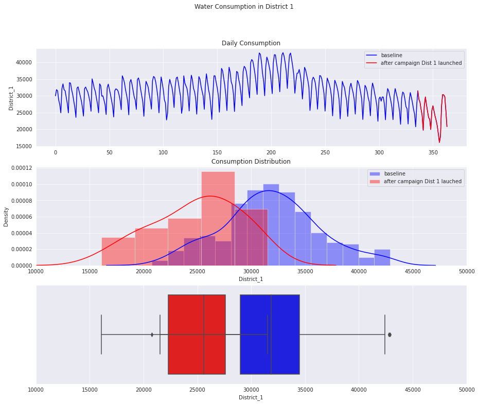
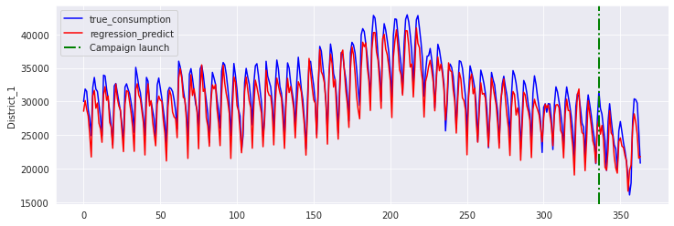

## Problem Definition
- A campaign is running to reduce the water consumption in District 1. 
- The city has 11 districts (Campaign only runs at District 1)
- Let's see how effective this campaign is

## Data Overview
- The row is the daily water consumption (in liters). There are total 364 rows (364 days) continuously from 01-January.
- The columns are 11 districts
- The campaign ran only in District 1 for the last 28 days (02-Dec to 30-Dec)
- Data samples are shown below

<div>
<table border="1" class="dataframe">
  <thead>
    <tr style="text-align: left;">
      <th>Day</th>
      <th>District_1</th>
      <th>District_2</th>
      <th>District_3</th>
      <th>District_4</th>
      <th>District_5</th>
      <th>District_6</th>
      <th>District_7</th>
      <th>District_8</th>
      <th>District_9</th>
      <th>District_10</th>
      <th>District_11</th>
    </tr>
  </thead>
  <tbody>
    <tr>
      <th>01-01</th>
      <td>30000.00</td>
      <td>25188.97</td>
      <td>28538.15</td>
      <td>31483.59</td>
      <td>30486.67</td>
      <td>30892.30</td>
      <td>30613.86</td>
      <td>27324.14</td>
      <td>25658.25</td>
      <td>28994.79</td>
      <td>27645.36</td>
    </tr>
    <tr>
      <th>02-01</th>
      <td>31859.96</td>
      <td>32538.84</td>
      <td>38301.84</td>
      <td>28500.64</td>
      <td>33390.60</td>
      <td>30254.08</td>
      <td>24096.06</td>
      <td>30740.24</td>
      <td>28504.75</td>
      <td>32948.60</td>
      <td>32895.67</td>
    </tr>
    <tr>
      <th>03-01</th>
      <td>31516.08</td>
      <td>36534.43</td>
      <td>24865.96</td>
      <td>37001.22</td>
      <td>30877.25</td>
      <td>26671.67</td>
      <td>23436.28</td>
      <td>30992.98</td>
      <td>27555.64</td>
      <td>30934.14</td>
      <td>31562.64</td>
    </tr>
    <tr>
      <th>04-01</th>
      <td>28790.81</td>
      <td>19551.51</td>
      <td>32441.73</td>
      <td>35832.19</td>
      <td>40637.68</td>
      <td>35049.81</td>
      <td>32555.86</td>
      <td>28242.00</td>
      <td>27142.70</td>
      <td>31642.02</td>
      <td>27085.91</td>
    </tr>
    <tr>
      <th>05-01</th>
      <td>27434.27</td>
      <td>33289.90</td>
      <td>30563.99</td>
      <td>36903.76</td>
      <td>36365.24</td>
      <td>27596.44</td>
      <td>19360.99</td>
      <td>28404.61</td>
      <td>33131.36</td>
      <td>29676.91</td>
      <td>23879.14</td>
    </tr>
  </tbody>
</table>
</div>

## Objective
- Evaluate whether the campaign have any significant impact on the water consumption in District 1? How much?


## Hypothesis (select  = 5%)
- : Campaign didn't have any impact on District 1 (coefficient of treament in linear equation with consumption = 0)
- : Campaign actually reduce the water consumption in District 1 (coefficient of treament in linear equation is significantly negative)
- One-tailed test valuation

## Helper Function
- `preproc.py` to plot, eda, and decompose time-series into cyclic seasonality features

### Example of Data Exploration

#### DISTRICT 1



#### DISTRICT 4


#### Notes:
- There could be a consumption distribution shift after the campaign lauched in District 1
- However, we're still unsure if the change is due to campaign or it's just seasonal effect, or it's just a randomness

### Convert time seasonal feature into cyclic features (Fourier Series) with sin and cos:
- Weekly cyclic features as the habit of using water can be repeated with the same weekday
- Yearly cyclic features as the habit of using water can vary depend upon season (i.e: more water used in summer than winter)
- Fourier series are decomposed at level 3

## Linear Regression Analysis for consumption of District 1 at day 

<br>


#### The objective is to see if        is significant negative than 0, this means the campaign is effective

### OLS Regression Analysis for District 1
```

                                OLS Regression Results                            
    ==============================================================================
    Dep. Variable:             District_1   R-squared:                       0.936
    Model:                            OLS   Adj. R-squared:                  0.932
    Method:                 Least Squares   F-statistic:                     216.1
    Date:                Sun, 24 Oct 2021   Prob (F-statistic):          1.83e-187
    Time:                        10:04:31   Log-Likelihood:                -3102.9
    No. Observations:                 364   AIC:                             6254.
    Df Residuals:                     340   BIC:                             6347.
    Df Model:                          23                                         
    Covariance Type:            nonrobust                                         
    =======================================================================================
                              coef    std err          t      P>|t|      [0.025      0.975]
    ---------------------------------------------------------------------------------------
    Intercept            6353.9583   1368.048      4.645      0.000    3663.054    9044.862
    sin_week_1n          1326.6134    121.505     10.918      0.000    1087.617    1565.610
    cos_week_1n          1052.4853    113.875      9.242      0.000     828.498    1276.473
    sin_week_2n          -338.5787     97.675     -3.466      0.001    -530.703    -146.455
    cos_week_2n           736.4401    103.287      7.130      0.000     533.278     939.602
    sin_week_3n          -385.2357     98.001     -3.931      0.000    -578.001    -192.471
    cos_week_3n          -172.2709     95.951     -1.795      0.073    -361.003      16.461
    sin_year_1n           240.9986    107.444      2.243      0.026      29.659     452.338
    cos_year_1n         -1610.5931    188.649     -8.538      0.000   -1981.659   -1239.527
    sin_year_2n           376.8972    123.336      3.056      0.002     134.300     619.495
    cos_year_2n           605.0006    143.525      4.215      0.000     322.692     887.309
    sin_year_3n           -61.6749    124.646     -0.495      0.621    -306.850     183.500
    cos_year_3n          -457.5879    128.098     -3.572      0.000    -709.551    -205.624
    District_2              0.0176      0.014      1.262      0.208      -0.010       0.045
    District_3              0.0243      0.014      1.793      0.074      -0.002       0.051
    District_4              0.0100      0.014      0.690      0.491      -0.018       0.038
    District_5              0.0318      0.015      2.124      0.034       0.002       0.061
    District_6              0.0666      0.015      4.544      0.000       0.038       0.095
    District_7              0.0483      0.015      3.307      0.001       0.020       0.077
    District_8              0.0548      0.017      3.226      0.001       0.021       0.088
    District_9              0.1075      0.018      5.863      0.000       0.071       0.144
    District_10             0.1373      0.022      6.180      0.000       0.094       0.181
    District_11             0.3010      0.026     11.588      0.000       0.250       0.352
    Treament_District_1 -1192.1777    503.144     -2.369      0.018   -2181.845    -202.510
    ==============================================================================
    Omnibus:                       11.642   Durbin-Watson:                   1.427
    Prob(Omnibus):                  0.003   Jarque-Bera (JB):               17.340
    Skew:                          -0.233   Prob(JB):                     0.000172
    Kurtosis:                       3.962   Cond. No.                     2.06e+06
    ==============================================================================
    
    Notes:
    [1] Standard Errors assume that the covariance matrix of the errors is correctly specified.
    [2] The condition number is large, 2.06e+06. This might indicate that there are
    strong multicollinearity or other numerical problems.
```

- Regression result shows that p-value of treatment coefficient (-1192.1777) = 0.005 < 0.05 / 2 for district 1
- This means we can reject the null hypothesis. The coefficient of treament effect is negatively significant and different from 0
- the daily water consumption at District 1 is predicted to be lower by 1192 litres (compared with the usual day), thanks to this campaign
- Also, p-value of variable `cos_week_3n`,  `sin_year_3n` and `consumption of district 2 to 4`  > 0.05, so this means those variables are not statistically significantly different from 0. So we can remove this from function
- The consumption of district 5 - 11 signficantly impacts the consumption at district 1

#### The water consumption model of District 1 is, therefore, explicitly represented by:


## Fit Metrics and Plots:

- Adjusted R squared =  0.932 <br>
- RMSE               =  2020.5 <br>
- MAE                =  1723.7 <br> 
- MAPE               =  0.056 <br>

##### DISTRICT 1 CONSUMPTION



- So we conclude the campaign at District 1 has the great impact to the consumption at District. The campaign can effectively reduce the water consumption by 880 litres, on average
- But do the campaign in District 1 also impacts other Districts ???

## Evaluate if the campaign in District 1 also impact other districts. Now we replace the fitting function with each district from 2 to 11

#### We can have the `p-value` summary of each coefficients for each district regression analysis as follows:

<table border="1" class="dataframe">  <thead>    <tr style="text-align: left;">      <th>Output</th>      <th>Coeff. Treament District 1</th>      <th>Coeff. District 1</th>      <th>Coeff. District 2</th>      <th>Coeff. District 3</th>      <th>Coeff. District 4</th>      <th>Coeff. District 5</th>      <th>Coeff. District 6</th>      <th>Coeff. District 7</th>      <th>Coeff. District 8</th>      <th>Coeff. District 9</th>      <th>Coeff. District 10</th>      <th>Coeff. District 11</th>    </tr>  </thead>  <tbody>    <tr>      <td>District 1</td>      <td>0.005</td>      <td></td>      <td>0.516</td>      <td>0.238</td>      <td>0.260</td>      <td>0.016</td>      <td>0.000</td>      <td>0.000</td>      <td>0.000</td>      <td>0.000</td>      <td>0.000</td>      <td>0.000</td>    </tr>    <tr>      <td>District 2</td>      <td>0.252</td>      <td>0.516</td>      <td></td>      <td>0.374</td>      <td>0.860</td>      <td>0.463</td>      <td>0.403</td>      <td>0.448</td>      <td>0.562</td>      <td>0.046</td>      <td>0.138</td>      <td>0.961</td>    </tr>    <tr>      <td>District 3</td>      <td>0.909</td>      <td>0.238</td>      <td>0.374</td>      <td></td>      <td>0.914</td>      <td>0.430</td>      <td>0.772</td>      <td>0.985</td>      <td>0.154</td>      <td>0.328</td>      <td>0.977</td>      <td>0.748</td>    </tr>    <tr>      <td>District 4</td>      <td>0.335</td>      <td>0.260</td>      <td>0.860</td>      <td>0.914</td>      <td></td>      <td>0.753</td>      <td>0.617</td>      <td>0.831</td>      <td>0.783</td>      <td>0.215</td>      <td>0.311</td>      <td>0.241</td>    </tr>    <tr>      <td>District 5</td>      <td>0.568</td>      <td>0.016</td>      <td>0.463</td>      <td>0.430</td>      <td>0.753</td>      <td></td>      <td>0.490</td>      <td>0.553</td>      <td>0.863</td>      <td>0.427</td>      <td>0.700</td>      <td>0.350</td>    </tr>    <tr>      <td>District 6</td>      <td>0.363</td>      <td>0.000</td>      <td>0.403</td>      <td>0.772</td>      <td>0.617</td>      <td>0.490</td>      <td></td>      <td>0.087</td>      <td>0.413</td>      <td>0.978</td>      <td>0.498</td>      <td>0.242</td>    </tr>    <tr>      <td>District 7</td>      <td>0.773</td>      <td>0.000</td>      <td>0.448</td>      <td>0.985</td>      <td>0.831</td>      <td>0.553</td>      <td>0.087</td>      <td></td>      <td>0.249</td>      <td>0.675</td>      <td>0.126</td>      <td>0.422</td>    </tr>    <tr>      <td>District 8</td>      <td>0.730</td>      <td>0.000</td>      <td>0.562</td>      <td>0.154</td>      <td>0.763</td>      <td>0.863</td>      <td>0.413</td>      <td>0.249</td>      <td></td>      <td>0.886</td>      <td>0.433</td>      <td>0.380</td>    </tr>    <tr>      <td>District 9</td>      <td>0.876</td>      <td>0.000</td>      <td>0.046</td>      <td>0.328</td>      <td>0.215</td>      <td>0.427</td>      <td>0.978</td>      <td>0.675</td>      <td>0.886</td>      <td></td>      <td>0.787</td>      <td>0.447</td>    </tr>    <tr>      <td>District 10</td>      <td>0.988</td>      <td>0.000</td>      <td>0.138</td>      <td>0.977</td>      <td>0.311</td>      <td>0.700</td>      <td>0.498</td>      <td>0.126</td>      <td>0.433</td>      <td>0.787</td>      <td></td>      <td>0.409</td>    </tr>    <tr>      <td>District 11</td>      <td>0.985</td>      <td>0.000</td>      <td>0.961</td>      <td>0.748</td>      <td>0.241</td>      <td>0.350</td>      <td>0.242</td>      <td>0.422</td>      <td>0.380</td>      <td>0.447</td>      <td>0.409</td>      <td></td>    </tr>  </tbody></table>

- The campaign does not significantly affect other districts. However
- It's interesting to see some pairs of district are correlated in water consumption:
    * District 1 with: district 5 - 11
    * District 2 with: district 9
    * District 6 with: district 7

## CONCLUSIONS and FUTURE WORK

- The campaign have significant impact on the water consumption in District 1. 
- Daily water consumption at District 1 is predicted to be lower by 1192 litres thanks to the campaign effect, compared with the usual day
- In the next steps, we could evaluate post-campaign effect on district 1, if the effect is just instantly one-off or it really changes the water usage behavior
- If campaign at district 1 has long-term effects, we could design the same campaigns for other districts
